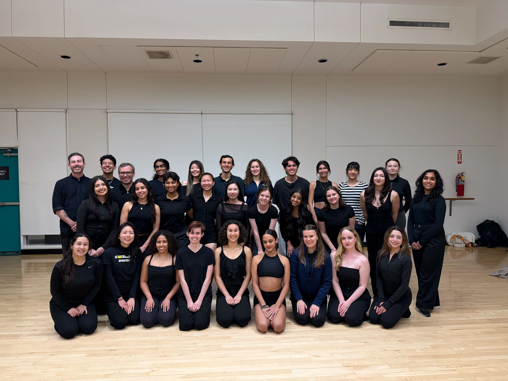

# About Me
`Hello World!` I'm Cadie Sparks, a third year **Computer Science** student at the *University of California, San Diego*. I'm interested in:
- [x] Web Development
- [x] Programming languages and tools
- [x] Technology for conservation science

Check out [some of my previous and ongoing projects](#my-projects)!

# My Projects
I've been involved with working on [ASPEN](https://github.com/ucsd-salad/aspen), a JupyterLab extension to assist with code clone management through editable, reusable code templates with visual diff highlighting.

Within this project my top contributions have been:
1. Tool development
2. Paper writing
3. User study design

# My Interests
Outside of computer science, some of my interests include:
+ Ballroom and latin dance
+ Volleyball
+ Drumming
+ Amateur radio

[Here's a photo of my ballroom team!](team-photo.jpg)

If near San Digo, you might occasionally hear me on the 20 meter or 70 cm amateur bands! Listen for:
> This is KO6LNE, Kilo Oscar Six, Lima November Echo.
